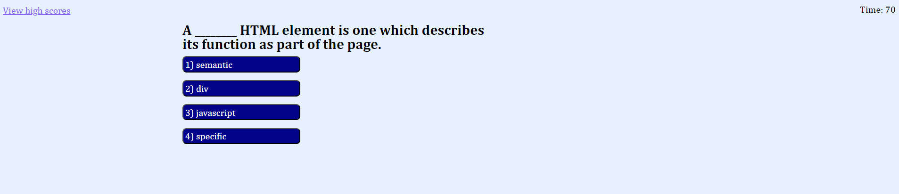
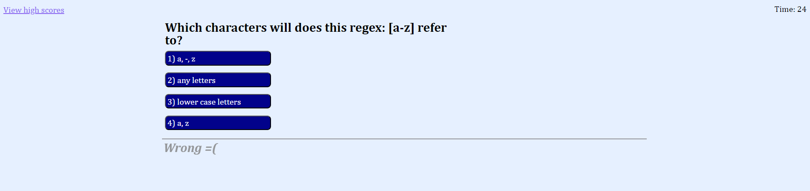

# Coding Quiz

## Description

Are you a programmer of any level? Or, do you just have an interest in coding and would like to learn more? Take my quiz! A brief quiz consisting of a series of 6 multiple-choice questions will help you learn or reinforce your codings knowledge and skills. The quiz includes a sleak, functional interface on any device and a color scheme that is clear and easy to read.

## Installation

No installation is necessary! Follow the following links to the github repository and live site.

Github repository: https://github.com/kurtriecken/Password-generator

Deployed site: https://kurtriecken.github.io/Password-generator/

## Usage

Below is screenshot of the deployed website. 

The first screen you will see is the welcome page, which includes a welcome banner, description of the quiz, and a start button in the center. At the top of your screen are a link to the high scores page and the timer, which will have been initialized to 75 seconds. That's how long you have for the quiz - run out of time and your score is a 0! Don't worry, the quiz is only 6 questions and they are all multiple choice. Experienced coders should have no problems answering everything but hopefully anyone who takes this can learn something or refresh their skills.

After clicking START, you will be given your first question.

Keep in mind, the questions AND the 4 answer choices are randomly selected, so not only will your screen likely not look like mine, but you should have lots of fun replaying the quiz to try and beat your score.

Answering each question will send an audio alert as to whether you got the answer right or wrong; in addition, text will appear under the next question telling you as much.

After answering the final questiong (or running out of time), you will be given your final score. You will also have a chance to enter your initials and record your score! As a note, scores are not shared across devices.

Finally, after submitting your initials OR clicking on the "View high scores" link at the top of the page, you will be directed to a list of the top 5 high scores. You may select to hit "Go back" and return to the main welcome page, or "Clear high scores" to erase the recorded high scores from the page and your device. See how high you can get your score!

## Credits

Written by kurtriecken (github.com/kurtriecken)

## License

MIT license